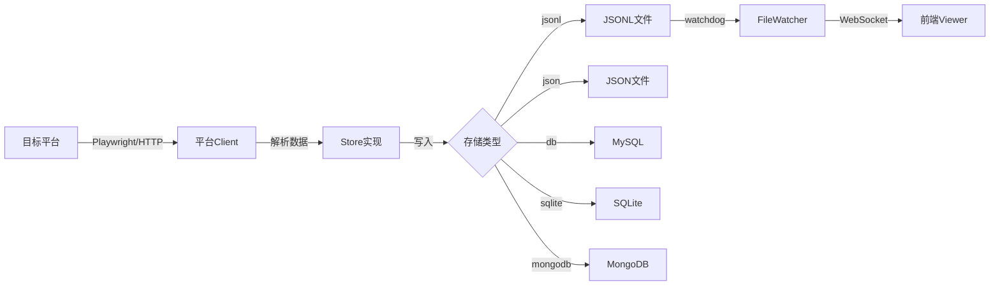
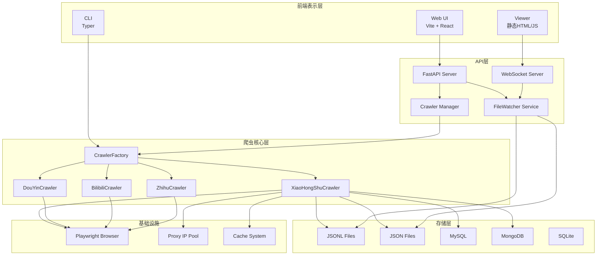

# MediaCrawler 架构文档

## 整体架构模式

MediaCrawler 采用**分层模块化架构**，结合**策略模式**和**工厂模式**实现多平台爬虫的统一管理。

### 架构风格

```
┌─────────────────────────────────────────────────────────────────┐
│                        表示层 (Presentation)                      │
│  ┌─────────────────┐  ┌─────────────────┐  ┌─────────────────┐  │
│  │   Web UI (Vite)  │  │  Viewer (静态)   │  │   CLI (Typer)   │  │
│  └────────┬────────┘  └────────┬────────┘  └────────┬────────┘  │
└───────────┼─────────────────────┼─────────────────────┼──────────┘
            │                     │                     │
            ▼                     ▼                     ▼
┌─────────────────────────────────────────────────────────────────┐
│                        API 层 (FastAPI)                          │
│  ┌──────────────────────────────────────────────────────────┐   │
│  │  Routers: crawler | data | websocket | notes | trends   │   │
│  └──────────────────────────────────────────────────────────┘   │
│  ┌──────────────────────────────────────────────────────────┐   │
│  │  Services: crawler_manager | file_watcher | subscription │   │
│  └──────────────────────────────────────────────────────────┘   │
└───────────────────────────────┬─────────────────────────────────┘
                                │
                                ▼
┌─────────────────────────────────────────────────────────────────┐
│                      核心爬虫层 (Core Crawler)                    │
│  ┌──────────────────────────────────────────────────────────┐   │
│  │              CrawlerFactory (工厂模式)                    │   │
│  │   ┌─────────┬─────────┬─────────┬─────────┬─────────┐   │   │
│  │   │   XHS   │   DY    │  Bili   │  Zhihu  │  Weibo  │   │   │
│  │   │ Crawler │ Crawler │ Crawler │ Crawler │ Crawler │   │   │
│  │   └─────────┴─────────┴─────────┴─────────┴─────────┘   │   │
│  └──────────────────────────────────────────────────────────┘   │
│  ┌──────────────────────────────────────────────────────────┐   │
│  │           AbstractCrawler / AbstractLogin (抽象基类)      │   │
│  └──────────────────────────────────────────────────────────┘   │
└───────────────────────────────┬─────────────────────────────────┘
                                │
                                ▼
┌─────────────────────────────────────────────────────────────────┐
│                       数据存储层 (Storage)                        │
│  ┌───────────┐ ┌───────────┐ ┌───────────┐ ┌───────────┐        │
│  │   JSON    │ │   CSV     │ │   Excel   │ │ Database  │        │
│  │  Store    │ │  Store    │ │  Store    │ │  Store    │        │
│  └───────────┘ └───────────┘ └───────────┘ └───────────┘        │
│  ┌──────────────────────────────────────────────────────────┐   │
│  │         Store Factory (策略模式切换存储方式)              │   │
│  └──────────────────────────────────────────────────────────┘   │
└─────────────────────────────────────────────────────────────────┘
```

---

## 核心模块详解

### 1. 爬虫核心模块 (media_platform/)

每个平台爬虫遵循统一的接口规范：

```python
# base/base_crawler.py - 抽象基类定义
class AbstractCrawler(ABC):
    @abstractmethod
    async def start(self): ...
    
    @abstractmethod
    async def search(self): ...
    
    @abstractmethod
    async def launch_browser(...): ...

class AbstractLogin(ABC):
    @abstractmethod
    async def login_by_qrcode(self): ...
    
    @abstractmethod
    async def login_by_cookies(self): ...

class AbstractStore(ABC):
    @abstractmethod
    async def store_content(self, content_item: Dict): ...
    
    @abstractmethod
    async def store_comment(self, comment_item: Dict): ...
```

#### 平台爬虫实现

| 平台 | 标识 | 核心类 | 数据模型 |
|------|------|--------|----------|
| 小红书 | xhs | XiaoHongShuCrawler | m_xiaohongshu.py |
| 抖音 | dy | DouYinCrawler | m_douyin.py |
| B站 | bili | BilibiliCrawler | m_bilibili.py |
| 知乎 | zhihu | ZhihuCrawler | m_zhihu.py |
| 微博 | wb | WeiboCrawler | m_weibo.py |
| 快手 | ks | KuaishouCrawler | m_kuaishou.py |
| 贴吧 | tieba | TieBaCrawler | m_baidu_tieba.py |

#### 爬虫工厂模式

```python
# main.py
class CrawlerFactory:
    CRAWLERS: dict[str, Type[AbstractCrawler]] = {
        "xhs": XiaoHongShuCrawler,
        "dy": DouYinCrawler,
        "ks": KuaishouCrawler,
        "bili": BilibiliCrawler,
        "wb": WeiboCrawler,
        "tieba": TieBaCrawler,
        "zhihu": ZhihuCrawler,
    }

    @staticmethod
    def create_crawler(platform: str) -> AbstractCrawler:
        crawler_class = CrawlerFactory.CRAWLERS.get(platform)
        return crawler_class()
```

---

### 2. API 服务层 (api/)

#### 路由模块

| 路由 | 文件 | 功能 |
|------|------|------|
| `/api/crawler` | crawler.py | 爬虫控制（启动/停止/状态） |
| `/api/data` | data.py | 数据查询 |
| `/api/notes` | notes.py | 小红书笔记 API |
| `/api/douyin` | douyin.py | 抖音数据 API |
| `/api/bilibili` | bilibili.py | B站数据 API |
| `/api/zhihu` | zhihu.py | 知乎数据 API |
| `/api/subscriptions` | subscriptions.py | 订阅管理 |
| `/api/trends` | trends.py | 趋势分析 |
| `/api/ws` | websocket.py | WebSocket 实时推送 |

#### 核心服务

**1. 文件监控服务 (file_watcher.py)**

```python
class FileWatcherService:
    """监控 JSONL/JSON 文件变更，触发 WebSocket 推送"""
    
    DEBOUNCE_SECONDS = 0.2  # 防抖窗口
    
    def start(self, platforms, base_callback, base_path): ...
    def stop(self): ...
    def _on_file_modified(self, event, platform): ...
```

**2. 爬虫管理服务 (crawler_manager.py)**

```python
class CrawlerManager:
    """管理爬虫子进程的生命周期"""
    
    process: subprocess.Popen  # 爬虫子进程
    logs: List[LogEntry]       # 日志队列
    
    async def start(self, request: CrawlerStartRequest): ...
    async def stop(self): ...
    def get_status(self): ...
```

---

### 3. 数据存储层 (store/)

#### 存储策略模式

支持多种存储后端，通过配置切换：

```python
# 存储实现类层次
AbstractStore (基类)
    ├── XhsCsvStoreImplement
    ├── XhsJsonStoreImplement
    ├── XhsJsonlStoreImplement
    ├── XhsDbStoreImplement (MySQL)
    ├── XhsSqliteStoreImplement
    ├── XhsMongoStoreImplement
    └── XhsExcelStoreImplement
```

#### 存储选择逻辑

```python
# config/__init__.py
SAVE_DATA_OPTION: str  # "jsonl" | "json" | "csv" | "excel" | "db" | "sqlite" | "mongodb"
```

---

### 4. 代理与缓存层

#### IP 代理池 (proxy/)

```python
class ProxyIpPool:
    """IP 代理池管理"""
    
    async def get_proxy(self) -> IpInfoModel: ...
    async def get_or_refresh_proxy(self, buffer_seconds): ...
    def is_current_proxy_expired(self, buffer_seconds): ...

# 代理提供商
IpProxyProvider: Dict[str, ProxyProvider] = {
    "kuai_daili": new_kuai_daili_proxy(),
    "wandou_http": new_wandou_http_proxy(),
}
```

#### 缓存系统 (cache/)

```python
class CacheFactory:
    @staticmethod
    def create_cache(cache_type: str, *args, **kwargs):
        if cache_type == 'memory':
            return ExpiringLocalCache(*args, **kwargs)
        elif cache_type == 'redis':
            return RedisCache()
```

---

### 5. 数据模型层 (model/ & database/)

#### SQLAlchemy ORM 模型

```python
# database/models.py
class XhsNote(Base):
    __tablename__ = "xhs_note"
    
    note_id: Mapped[str] = mapped_column(primary_key=True)
    title: Mapped[str]
    desc: Mapped[str]
    user_id: Mapped[str]
    # ...

class XhsNoteComment(Base):
    __tablename__ = "xhs_note_comment"
    
    comment_id: Mapped[str] = mapped_column(primary_key=True)
    note_id: Mapped[str]
    content: Mapped[str]
    # ...
```

#### Pydantic 数据模型

```python
# model/m_xiaohongshu.py
class NoteUrlInfo(BaseModel):
    note_id: str
    xsec_source: str
    xsec_token: str

class CreatorUrlInfo(BaseModel):
    user_id: str
    xsec_token: str
    xsec_source: str
```

---

## 数据流向

### 爬虫数据流



### 实时更新数据流

```
爬虫写入文件 → FileWatcher监控变更 → 防抖处理 → WebSocket广播 → 前端UI更新
```

---

## 关键设计决策

### 1. 浏览器自动化选择 Playwright

**原因：**
- 支持 Chromium/Firefox/WebKit
- 原生异步支持
- 强大的反检测能力
- 支持持久化上下文（登录状态）

### 2. 双模式浏览器启动

```python
# 标准模式 - 使用 Playwright 内置浏览器
browser_context = await chromium.launch_persistent_context(...)

# CDP 模式 - 连接外部浏览器
browser_context = await playwright.chromium.connect_over_cdp(...)
```

### 3. 签名算法外置 (xhshow)

```python
# media_platform/xhs/playwright_sign.py
def sign_with_xhshow(uri: str, data: dict, cookie_str: str, method: str):
    """使用纯算法生成 XHS 请求签名"""
    # 避免使用 JS 执行，提高稳定性
```

### 4. WebSocket 实时通信

```python
# api/routers/websocket.py
@router.websocket("/ws")
async def websocket_endpoint(websocket: WebSocket):
    """实时推送爬虫状态和数据更新"""
    await manager.connect(websocket)
    # 广播消息给所有连接的客户端
    await broadcast_stats_update(platform)
```

### 5. 多平台模块化设计

每个平台独立模块，包含：
- `core.py` - 爬虫核心逻辑
- `client.py` - API 客户端
- `login.py` - 登录逻辑
- `field.py` - 枚举和常量
- `help.py` - 辅助函数
- `exception.py` - 自定义异常

---

## 架构图 (Mermaid)



---

## 技术栈总结

| 层级 | 技术选型 |
|------|----------|
| 前端 | HTML/CSS/JavaScript (无框架) + Vite (WebUI) |
| 后端 | Python 3.11+ + FastAPI + Uvicorn |
| 浏览器自动化 | Playwright |
| HTTP 客户端 | httpx |
| 数据验证 | Pydantic |
| ORM | SQLAlchemy 2.0 |
| 数据库 | MySQL / SQLite / MongoDB |
| 缓存 | Redis / 本地内存缓存 |
| 文件监控 | watchdog |
| 实时通信 | WebSocket |
| 包管理 | uv |
