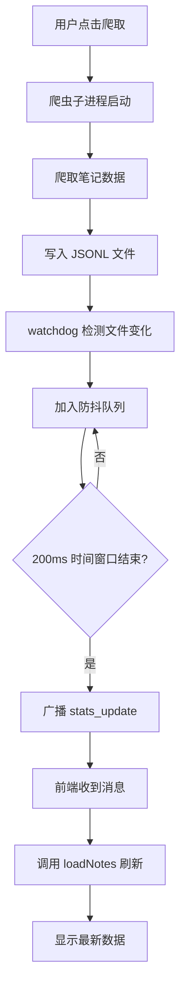

# 实时数据同步 - 需求文档

## Problem Frame

**用户痛点**: 点击爬取按钮后，viewer 页面不会实时更新数据，即使手动刷新也经常看不到最新内容。

**根本原因**:
1. 爬虫以子进程方式运行，独立写入 JSONL 文件
2. FastAPI 主进程不知道文件何时被修改
3. 前端 WebSocket 处理器已准备好接收 `new_note`/`stats_update` 消息，但后端从未发送

**影响**: 用户需要反复手动刷新，体验差，不确定数据是否已爬取成功。

## Requirements

**文件监视**
- R1. 使用 `watchdog` 库监听 `data/xhs/jsonl/` 目录的文件修改事件
- R2. 检测到 JSONL 文件追加内容时，触发通知流程

**批量防抖推送**
- R3. 收集 200ms 时间窗口内的所有文件变化事件
- R4. 时间窗口结束时，通过 WebSocket 广播 `stats_update` 消息
- R4a. 维护内存中的 total_notes 和 total_images 计数器，增量更新而非每次重新计算
- R5. 消息格式: `{"type": "stats_update", "total_notes": N, "total_images": M, "timestamp": "..."}`

**前端响应**
- R6. 前端收到 `stats_update` 消息后，自动调用 `loadNotes()` 刷新笔记列表（前端处理逻辑已存在于 `monitor.js`，无需修改）
- R7. 前端收到消息后，更新统计数据显示

**后台任务管理**
- R8. 文件监视器作为 FastAPI 后台任务启动
- R9. 应用关闭时优雅停止文件监视器

**初始状态同步**
- R10. WebSocket 连接建立时，立即广播当前统计数据，确保新连接客户端获得准确状态

**轮询优化**
- R11. WebSocket 连接活跃时，禁用 HTTP 轮询；WebSocket 断开时自动启用轮询作为降级

## Success Criteria

1. **实时性**: 点击爬取后，viewer 在 **1000ms 内** 显示新数据（无需手动刷新）
   - 注：500ms 目标在考虑文件监视开销、200ms 防抖窗口、WebSocket 传输和前端渲染后不现实，已调整为 1000ms
2. **准确性**: 显示的笔记数量与 JSONL 文件中的实际数量一致
3. **稳定性**: WebSocket 断开重连后，(a) 文件监视器不重启或丢失状态，(b) 重连后立即推送最新统计数据

## Scope Boundaries

**包含**:
- 添加 watchdog 依赖
- 创建文件监视后台任务
- 修改 WebSocket 广播逻辑
- 前端消息处理（已存在，无需修改）

**不包含**:
- 修改爬虫核心代码
- 添加 Redis 或其他消息队列
- 实现增量数据推送（只推送变化，不推送全量）
- 处理多平台数据同步（仅限小红书）

## Key Decisions

| 决策 | 选择 | 理由 |
|------|------|------|
| 通知机制 | 文件监视器 | 解耦通知机制，无需修改爬虫代码 |
| 推送策略 | 批量防抖 (200ms) | 减少 UI 闪烁，避免频繁刷新 |
| 消息类型 | `stats_update` | 前端已有处理逻辑，复用现有代码 |
| 监视范围 | 仅 JSONL 目录 | 图片文件变化不需要通知 |

## Dependencies / Assumptions

- `watchdog` 库可用于文件系统事件监听
- JSONL 文件采用追加写入模式（不覆盖）
- 前端 WebSocket 连接保持活跃
- **单进程部署**: 本设计假设 FastAPI 以单 worker 运行（uvicorn 默认行为）。多 worker 部署需要 Redis 或类似 pub/sub 机制，已明确排除在范围之外

## Outstanding Questions

### Deferred to Planning

- [Affects R1][Technical] watchdog 在 Windows 上的性能表现如何？是否需要调整轮询模式？
- [Affects R4][Technical] 如何处理文件正在写入时的部分行问题？
- [Affects R8][Technical] 文件监视器应该在哪里初始化？`main.py` 的 lifespan 还是 `websocket.py`？
- [Affects R2][Technical] 如何检测真正的追加写入 vs 覆盖写入？需要追踪文件大小/位置吗？

## User Flow

## Next Steps

→ `/ce:plan` for structured implementation planning
