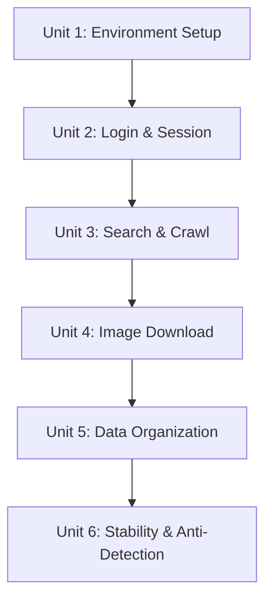

# feat: Xiaohongshu Content Crawler System

## Overview

构建一个基于 MediaCrawler 框架的小红书内容爬取系统，支持二维码扫码登录、关键词搜索笔记、下载文案和图片，数据存储为本地 JSON 文件。核心诉求是**稳定可靠**地获取内容，而非高频批量爬取。

## Problem Frame

用户需要从小红书平台检索特定主题的笔记，爬取文案和图片内容以便搬运到其他平台。小红书有严格的反爬机制（签名算法、登录态检测、浏览器指纹识别），传统请求方式极易被封禁。

## Requirements Trace

| ID | Requirement | Implementation Units |
|----|-------------|---------------------|
| R1 | 支持二维码扫码登录小红书 | Unit 1, Unit 2 |
| R2 | 支持登录态缓存，避免重复扫码 | Unit 2 |
| R3 | 支持关键词搜索小红书笔记 | Unit 3 |
| R4 | 爬取笔记的文案内容（标题、正文、标签） | Unit 3 |
| R5 | 下载笔记中的图片（原图或高清图） | Unit 4 |
| R6 | 支持爬取笔记的基本信息（点赞数、收藏数等） | Unit 3 |
| R7 | 将爬取的内容保存到本地 | Unit 5 |
| R8 | 支持结构化存储（JSONL格式） | Unit 5 |
| R9 | 图片按笔记分类存储 | Unit 4 |
| R10 | 采用浏览器自动化方案 | Unit 1 |
| R11 | 模拟真实用户行为，避免触发反爬机制 | Unit 1, Unit 6 |
| R12 | 支持请求频率控制，降低封禁风险 | Unit 6 |

## Scope Boundaries

- 仅爬取公开数据，不涉及私密内容
- 不支持自动化搬运到其他平台（仅本地存储）
- 不支持视频内容的下载（仅图片和文案）
- 不支持评论区深度爬取
- 不支持多账号管理
- 稳定性优先，不追求高频爬取

## Context & Research

### Relevant Code and Patterns

**现有项目状态：**
- 新项目（greenfield），目前只有 Tavily 搜索技能
- Python 3.12.9，使用 venv + pip
- 无现有爬虫代码

**MediaCrawler 框架特性：**
- 基于 Playwright 浏览器自动化，无需逆向签名算法
- 原生支持小红书平台 (PLATFORM = "xhs")
- 支持二维码登录、Cookie 登录、手机号登录
- 支持关键词搜索、指定帖子爬取、创作者主页爬取
- 支持 CSV、JSON、JSONL、SQLite、MySQL 存储
- 支持 CDP 模式连接真实浏览器（强烈推荐防封号）
- 支持 IP 代理池（可选）

**项目目录结构约定：**
```
research_for_pachong/
├── .claude/skills/        # Claude 技能
├── data/                  # 爬取数据存储
│   ├── notes/             # JSON 文件
│   └── images/            # 图片文件 {note_id}/
├── config/                # 配置文件
│   ├── base_config.py     # 核心配置
│   └── keywords.txt       # 关键词列表
├── browser_data/          # 浏览器登录态缓存
├── MediaCrawler/          # 克隆的框架代码
└── docs/                  # 文档
```

### Institutional Learnings

**Playwright 反检测模式 (from browser-automation skill):**
- 使用用户可见的定位器 (getByRole, getByText) 而非 CSS/XPath
- 利用 Playwright 自动等待而非手动 timeout
- 每个操作使用独立的浏览器上下文隔离状态

**会话管理模式 (from Playwright docs):**
- 使用 `browser.newContext({ storageState: path })` 持久化会话
- 保存 cookies/localStorage 到文件实现会话复用
- 登录流程等待 URL 重定向验证成功

**小红书检测向量 (from anti-detection research):**
- Layer 1: xsec_token 验证 - 每个笔记读取需要从搜索结果获取 token
- Layer 2: 签名请求头 (x-s, x-s-common, x-t) 和 cookies (a1, webId, sec_poison_id)
- Layer 3: 设备指纹 (21-27 参数) - Canvas/WebGL, fonts, screen, hardware
- Layer 4: 行为分析 - 请求时序模式、鼠标/滚动/键盘动态

### External References

- MediaCrawler GitHub: https://github.com/NanmiCoder/MediaCrawler
- Playwright Auth Docs: https://playwright.dev/docs/auth
- Playwright Stealth Guide: https://scrapfly.io/blog/posts/playwright-stealth-bypass-bot-detection

## Key Technical Decisions

| Decision | Choice | Rationale |
|----------|--------|-----------|
| 核心框架 | MediaCrawler | 46K+ Stars，成熟稳定，Playwright-based，无需逆向签名算法 |
| 浏览器模式 | **CDP 模式** (强烈推荐) | 连接真实浏览器，复用 Cookie 和登录状态，大幅降低风控风险 |
| 登录方式 | 二维码扫码 | 用户体验好，安全性高，MediaCrawler 原生支持 |
| 爬取模式 | 关键词搜索 | 灵活性高，可随时更换搜索词，覆盖面广 |
| 数据存储 | JSONL 格式 | 追加写入性能好，每行一个 JSON 对象，便于处理 |
| 浏览器 | Playwright (Chromium) | 反检测能力强，MediaCrawler 默认使用 |
| 频率控制 | 随机延迟 2-5 秒 | 模拟人类行为，降低封禁风险 |
| 无头模式 | 首次登录 False，后续可选 | 小红书风控严格，首次登录需显示浏览器处理滑块验证 |

## Open Questions

### Resolved During Planning

- **Q: 是否需要代理池？** → 根据需求文档，爬取频率较低，暂不需要代理池
- **Q: 存储格式选择？** → JSONL 格式，追加写入性能好于 JSON
- **Q: 是否使用 CDP 模式？** → 强烈推荐，大幅降低风控风险
- **Q: 图片下载策略？** → 默认 3 并发，最大重试 3 次

### Deferred to Implementation

- **登录态过期检测阈值** → 建议在实现时测试小红书的会话有效期，通常 24-72 小时
- **具体反检测配置** → MediaCrawler 默认配置通常足够，如有问题再调整 stealth scripts
- **图片 URL 过期处理** → 小红书图片 URL 有时效性，需在实现时测试处理策略

## Implementation Units

### Unit Dependency Graph



---

- [ ] **Unit 1: Environment Setup**

**Goal:** 安装并配置 MediaCrawler 框架及所有依赖项

**Requirements:** R10

**Dependencies:** None

**Files:**
- Clone: `MediaCrawler/` (外部仓库)
- Create: `config/base_config.py` (本地配置)
- Create: `config/keywords.txt` (关键词列表)
- Create: `activate.bat` / `activate.sh` (环境激活脚本)

**Approach:**
1. 安装 uv 包管理器 (推荐)
2. 克隆 MediaCrawler 仓库到项目根目录
3. 同步依赖：`uv sync`
4. 安装 Playwright 浏览器驱动：`uv run playwright install chromium`
5. 创建本地配置文件覆盖默认设置
6. 验证安装：运行 `uv run main.py --help`

**Technical design:**
```bash
# 安装步骤 (方向性指导)
# 1. 安装 uv
# Windows PowerShell
powershell -ExecutionPolicy ByPass -c "irm https://astral.sh/uv/install.ps1 | iex"

# 2. 克隆项目
git clone https://github.com/NanmiCoder/MediaCrawler.git
cd MediaCrawler

# 3. 同步依赖
uv sync

# 4. 安装浏览器
uv run playwright install chromium
```

**Patterns to follow:**
- MediaCrawler 官方安装文档
- 项目现有 venv 模式

**Test scenarios:**
- Happy path: `uv run main.py --help` 成功显示帮助信息
- Error path: Playwright 驱动安装失败时给出清晰错误提示
- Edge case: Node.js 未安装时提示安装

**Verification:**
- `uv run main.py --help` 能正常执行
- Playwright 能启动 Chromium 浏览器

---

- [ ] **Unit 2: Login & Session Configuration**

**Goal:** 配置二维码扫码登录、CDP 模式和登录态缓存

**Requirements:** R1, R2

**Dependencies:** Unit 1

**Files:**
- Modify: `config/base_config.py` (登录配置)
- Create: `browser_data/` 目录 (浏览器用户数据缓存)

**Approach:**
1. 配置登录方式为二维码：`LOGIN_TYPE = "qrcode"`
2. **启用 CDP 模式**：连接真实浏览器降低风控
3. 配置登录态缓存路径和持久化
4. 首次登录设置 `HEADLESS = False` 以处理滑块验证
5. 测试扫码登录和会话复用流程

**Technical design:**
```python
# config/base_config.py 方向性配置

# 平台配置
PLATFORM = "xhs"
XHS_INTERNATIONAL = False  # 使用国内版

# 登录配置
LOGIN_TYPE = "qrcode"
SAVE_LOGIN_STATE = True
HEADLESS = False  # 首次登录需要显示浏览器处理滑块

# CDP 模式 (强烈推荐防封号)
ENABLE_CDP_MODE = True
CDP_DEBUG_PORT = 9222
CDP_HEADLESS = False

# 用户数据目录
USER_DATA_DIR = "./browser_data"
```

**Patterns to follow:**
- MediaCrawler 的 `base_config.py` 配置模式
- Playwright 会话持久化模式

**Test scenarios:**
- Happy path: 扫码后成功登录，登录态保存到 browser_data/
- Happy path: 再次运行时无需扫码，直接使用缓存登录态
- Edge case: QR 码超时 (30-60s) 时自动刷新或提示
- Edge case: 登录态过期时提示重新扫码
- Edge case: 浏览器数据目录损坏时回退到新登录

**Verification:**
- 成功扫码登录小红书
- `browser_data/` 目录下生成登录态文件
- 重启程序后无需扫码即可访问
- 能发起已认证请求验证登录状态

---

- [ ] **Unit 3: Search & Crawl Configuration**

**Goal:** 配置关键词搜索和笔记内容爬取

**Requirements:** R3, R4, R6

**Dependencies:** Unit 2

**Files:**
- Modify: `config/base_config.py` (搜索配置)
- Create: `config/keywords.txt` (关键词列表)

**Approach:**
1. 配置爬取类型为搜索：`CRAWLER_TYPE = "search"`
2. 创建关键词配置文件或直接配置
3. 配置需要爬取的字段（标题、正文、标签、点赞数等）
4. 配置最大爬取数量限制
5. 测试搜索爬取功能

**Technical design:**
```python
# config/base_config.py 方向性配置

# 爬取配置
PLATFORM = "xhs"
CRAWLER_TYPE = "search"
KEYWORDS = "Python教程,AI工具,自媒体运营"  # 英文逗号分隔

# 爬取数量控制
START_PAGE = 1
CRAWLER_MAX_NOTES_COUNT = 50  # 每个关键词最大笔记数

# 评论配置 (暂不爬取)
ENABLE_GET_COMMENTS = False
ENABLE_GET_SUB_COMMENTS = False
```

**Patterns to follow:**
- MediaCrawler 的搜索配置模式

**Test scenarios:**
- Happy path: 输入关键词后返回相关笔记列表
- Happy path: 成功提取标题、正文、标签、点赞数、收藏数、评论数等字段
- Edge case: 关键词无结果时优雅处理，不崩溃
- Edge case: 搜索结果中笔记已删除 (404) 时跳过并记录
- Edge case: 搜索触发限流 (429) 时指数退避重试
- Error path: 搜索触发验证码时暂停并提示人工处理

**Verification:**
- 能通过关键词搜索获取笔记列表
- 每条笔记包含完整的文案和元数据信息
- 搜索结果中的 note_id 有效可用于后续下载

---

- [ ] **Unit 4: Image Download Configuration**

**Goal:** 配置图片下载、存储路径和完整性验证

**Requirements:** R5, R9

**Dependencies:** Unit 3

**Files:**
- Modify: `config/base_config.py` (图片配置)
- Create: `data/xhs/images/` 目录结构 (MediaCrawler 默认路径)

**Approach:**
1. 启用图片下载功能 (`ENABLE_GET_MEIDAS = True`)
2. 图片自动存储到 MediaCrawler 默认路径：`data/xhs/images/{note_id}/`
3. MediaCrawler 内部处理下载并发和重试
4. 添加图片完整性验证

**Technical design:**
```python
# config/base_config.py 方向性配置

# 图片下载配置
ENABLE_GET_MEIDAS = True  # MediaCrawler 使用此变量控制媒体下载
# 图片默认存储到 data/xhs/images/{note_id}/

# 下载控制 (MediaCrawler 内部处理，无需额外配置)
# 并发数和重试由框架内部控制
```

**Patterns to follow:**
- MediaCrawler 的图片下载配置

**Test scenarios:**
- Happy path: 笔记图片成功下载到 `data/xhs/images/{note_id}/`
- Happy path: 图片按笔记 ID 分类存储，目录结构正确
- Happy path: 下载的图片文件可正常打开
- Edge case: 笔记无图片时跳过下载，不创建空目录
- Edge case: 笔记包含视频时跳过或记录 (非图片笔记)
- Error path: 图片 URL 过期时尝试从笔记页面重新获取
- Error path: 图片下载失败时记录日志并跳过 (MediaCrawler 内部重试)
- Error path: 磁盘空间不足时停止并提示

**Verification:**
- 图片存储在 `data/xhs/images/{note_id}/` 目录
- 图片文件完整可打开 (非零大小、正确格式)
- 下载失败有清晰的错误日志

---

- [ ] **Unit 5: Data Organization**

**Goal:** 配置 JSONL 存储格式和目录结构

**Requirements:** R7, R8

**Dependencies:** Unit 4

**Files:**
- Modify: `config/base_config.py` (存储配置)
- Use: `data/xhs_note/` 目录 (MediaCrawler 默认 JSONL 路径)

**Approach:**
1. 配置存储类型为 JSONL（追加写入性能好）
2. 配置 JSON 文件存储路径
3. 配置数据字段映射（确保包含所有需要的字段）
4. 验证输出数据格式和完整性

**Technical design:**
```python
# config/base_config.py 方向性配置
SAVE_DATA_OPTION = "jsonl"  # JSONL 存储 (追加写入性能好)
SAVE_DATA_PATH = ""  # 空则使用默认 data/ 目录
```

**JSONL 输出格式示例:**
```json
{"note_id": "xxx", "title": "笔记标题", "desc": "正文内容", "tags": ["标签1", "标签2"], "liked_count": 100, "collected_count": 50, "comment_count": 20, "image_list": ["url1", "url2"], "user_id": "作者ID", "nickname": "作者名", "time": "发布时间", "note_url": "笔记链接", "crawl_time": "2026-04-17T12:00:00"}
```

**Patterns to follow:**
- MediaCrawler 的数据存储格式

**Test scenarios:**
- Happy path: 爬取的数据保存为结构化 JSONL
- Happy path: JSONL 包含所有必需字段 (note_id, title, desc, tags, stats)
- Happy path: 中文、emoji 等特殊字符正确编码
- Edge case: 字段缺失时使用默认值或 null
- Edge case: 大量笔记 (1000+) 时文件写入性能正常
- Error path: 写入权限不足时清晰报错

**Verification:**
- `data/xhs_note/` 目录下生成 JSONL 文件
- JSONL 格式正确，每行一个有效 JSON 对象
- 所有必需字段存在，无数据丢失

---

- [ ] **Unit 6: Stability & Anti-Detection**

**Goal:** 配置请求频率控制、人类行为模拟和稳定性增强

**Requirements:** R11, R12

**Dependencies:** Unit 5

**Files:**
- Modify: `config/base_config.py` (频率控制配置)

**Approach:**
1. 配置请求间随机延迟 (2-5秒)
2. 配置人类行为模拟
3. 配置登录后无头模式 (可选)
4. 添加爬取统计和日志
5. 实现错误分类和恢复策略

**Technical design:**
```python
# config/base_config.py 方向性配置

# 频率控制
CRAWLER_MAX_SLEEP_SEC = 3  # 每次请求间隔秒数
MAX_CONCURRENCY_NUM = 1  # 并发数 (建议保持 1)

# 稳定性配置
HEADLESS = True  # 登录后可使用无头模式
ENABLE_JAVASCRIPT = True

# SSL (使用代理工具时可能需要)
DISABLE_SSL_VERIFY = False
```

**Error Classification:**
| Error Type | Code | Recovery |
|------------|------|----------|
| Session Expired | -104 | Auto re-login |
| Rate Limited | 461 | Exponential backoff |
| IP Blocked | 300012 | Stop, rotate proxy if available |
| Captcha | verification_required | Pause, manual intervention |
| Note Not Found | 404 | Log and skip |

**Test scenarios:**
- Happy path: 请求间隔在 2-5 秒范围内随机
- Happy path: 连续爬取 50 条笔记不被封禁
- Happy path: 连续运行 72 小时稳定无故障
- Edge case: 检测到限流 (461) 时自动退避重试
- Edge case: 检测到验证码时暂停并提示
- Error path: 检测到 IP 封禁时停止并记录

**Verification:**
- 程序能稳定运行，请求间隔合理
- 日志记录完整，便于排查问题
- 错误有清晰的分类和处理策略

---

## System-Wide Impact

- **数据流:** 用户扫码 → MediaCrawler 登录 → 关键词搜索 → 笔记爬取 → 图片下载 → JSONL 存储
- **错误传播:** 网络错误 → 重试 (指数退避) → 日志记录 → 继续或停止
- **状态管理:** 登录态缓存 → browser_data/ 目录 → 会话复用
- **并发控制:** 图片下载并发数限制 (建议 3)，搜索请求串行
- **数据一致性:** 笔记爬取和图片下载分离时可能产生孤儿数据

## Risks & Dependencies

| Risk | Likelihood | Impact | Mitigation |
|------|------------|--------|------------|
| 小红书反爬策略更新 | Medium | High | 使用 CDP 模式，关注 MediaCrawler GitHub Issues 及时更新 |
| 登录态频繁过期 | Medium | Medium | 实现过期检测和自动重新登录流程 |
| IP 被封禁 | Low | High | 低频率爬取 (2-5s 延迟) + 随机延迟，暂不使用代理 |
| 图片下载失败 | Medium | Low | 重试机制 (3次) + 错误日志 + 跳过继续 |
| QR 码超时 | Low | Low | 30-60s 超时自动刷新或提示重新扫码 |
| 触发验证码 | Medium | Medium | 暂停并提示人工处理，记录触发条件 |

## Documentation / Operational Notes

### 使用流程

1. **首次运行：** 扫码登录
   ```bash
   cd MediaCrawler
   uv run main.py --platform xhs --lt qrcode --type search
   ```

2. **配置关键词：** 编辑 `config/base_config.py` 中的 KEYWORDS 或创建 `config/keywords.txt`

3. **启动爬取：**
   ```bash
   uv run main.py --platform xhs --lt qrcode --type search --save_data_option jsonl
   ```

4. **数据位置：**
   - 笔记数据：`data/xhs_note/` (JSONL 文件)
   - 图片数据：`data/images/{note_id}/`

### 维护说明

- 定期检查 MediaCrawler 更新：`git pull` 或关注 GitHub Releases
- 监控登录态有效期，失效时删除 `browser_data/` 重新登录
- 关注小红书反爬策略变化，必要时调整延迟参数
- 日志位置：MediaCrawler 内置日志输出

### 故障排除

| 问题 | 解决方案 |
|------|---------|
| 滑块验证不通过 | 使用 CDP 模式连接真实浏览器，或删除 `browser_data/` 重新登录 |
| 登录状态失效 | 删除 `browser_data/` 文件夹重新扫码登录 |
| Playwright 超时 | 检查是否开了 VPN，关闭后重试 |
| Node 环境缺失 | 安装 Node.js >= v16 |
| 图片下载失败 | 检查网络连接，图片 URL 可能已过期 |

## Sources & References

- **Origin document:** [docs/brainstorms/2026-04-17-xiaohongshu-crawler-requirements.md](../brainstorms/2026-04-17-xiaohongshu-crawler-requirements.md)
- MediaCrawler GitHub: https://github.com/NanmiCoder/MediaCrawler
- MediaCrawler 中文文档: https://github.com/NanmiCoder/MediaCrawler/blob/main/README.md
- Playwright Auth Docs: https://playwright.dev/docs/auth
- Playwright Stealth Guide: https://scrapfly.io/blog/posts/playwright-stealth-bypass-bot-detection
