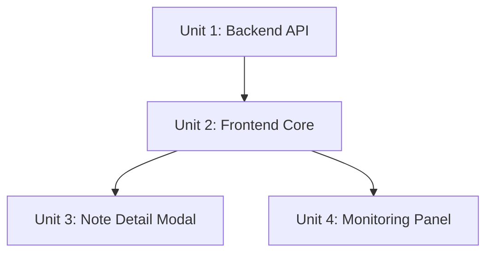

# feat: Xiaohongshu Data Viewer Web Interface

## Overview

构建一个基于现有 FastAPI 后端的 Web 数据展示界面，用于浏览和监控小红书爬取数据。复用项目现有的 API 基础设施、WebSocket 实时通信机制，前端采用纯 HTML/CSS/JS 实现瀑布流卡片布局。

## Problem Frame

用户已通过 MediaCrawler 爬取小红书笔记数据，需要一个美观的 Web 界面来：
1. **浏览数据** - 瀑布流卡片展示笔记，支持筛选和搜索
2. **监控状态** - 实时显示爬取进度和统计信息

## Requirements Trace

| ID | Requirement | Implementation Units |
|----|-------------|---------------------|
| R1 | 瀑布流卡片布局展示笔记列表 | Unit 2, Unit 3 |
| R2 | 卡片显示封面图、标题、作者、互动数 | Unit 2 |
| R3 | 点击卡片查看笔记详情 | Unit 3 |
| R4 | 按关键词筛选笔记 | Unit 2 |
| R5 | 搜索笔记标题 | Unit 2 |
| R6 | 显示爬取状态 | Unit 4 |
| R7 | 显示统计信息 | Unit 4 |
| R8 | 显示最近爬取的笔记 | Unit 4 |
| R9 | 轮询刷新数据 | Unit 4 |
| R10 | 手动刷新按钮 | Unit 2 |
| R11 | 显示最后更新时间 | Unit 4 |
| R12 | 响应式设计 | Unit 2 |
| R13 | 图片懒加载 | Unit 2 |
| R14 | 美观的 UI | Unit 2 |

## Scope Boundaries

- 仅展示本地数据，不提供编辑功能
- 不实现用户认证
- 不提供数据导出功能
- 不支持视频播放（仅展示封面）
- 复用现有 FastAPI 后端，不创建独立的 Flask 服务

## Context & Research

### Relevant Code and Patterns

**现有 FastAPI 后端** (`api/`):
- `api/main.py` - FastAPI 应用入口，端口 8080
- `api/routers/data.py` - 数据文件 API（需扩展支持 JSONL）
- `api/routers/websocket.py` - WebSocket 实时通信
- `api/services/crawler_manager.py` - 爬虫进程管理

**数据存储结构**:
- JSONL: `data/xhs/jsonl/search_contents_YYYY-MM-DD.jsonl`
- 图片: `data/xhs/images/{note_id}/0.jpg, 1.jpg, ...`

**JSONL 数据格式**:
```json
{
  "note_id": "xxx",
  "title": "笔记标题",
  "desc": "正文内容",
  "nickname": "作者名",
  "liked_count": "1.1万",
  "collected_count": "1万",
  "image_list": "url1,url2,url3",
  "tag_list": "标签1,标签2",
  "source_keyword": "Python教程",
  "note_url": "https://..."
}
```

**现有 WebUI** (`api/webui/`):
- React + Vite 构建的控制台界面
- 可参考其静态资源挂载方式

### Institutional Learnings

- FastAPI 静态文件服务使用 `StaticFiles` 挂载
- WebSocket 使用 `ConnectionManager` 广播模式
- 路径安全检查使用 `resolve().relative_to()` 防止路径遍历

### External References

- FastAPI 文档: https://fastapi.tiangolo.com/
- CSS Grid 瀑布流: https://css-tricks.com/snippets/css/complete-guide-grid/

## Key Technical Decisions

| Decision | Choice | Rationale |
|----------|--------|-----------|
| 后端框架 | 扩展现有 FastAPI | 项目已有完整的 FastAPI 基础设施，无需新建 Flask |
| 实时通信 | 复用 WebSocket | 现有 `api/routers/websocket.py` 已实现广播机制 |
| 前端技术 | 纯 HTML/CSS/JS | 简单直接，无需构建工具，适合快速开发 |
| 瀑布流布局 | CSS columns | 原生支持真正的瀑布流效果，无需 JS 库，性能好 |
| 图片服务 | FastAPI 静态路由 | 挂载 `data/xhs/images/` 为 `/images/`（避免与现有 `/static` 冲突） |
| 轮询间隔 | 5 秒 | 平衡实时性和服务器负载 |
| 爬取状态 | 进程检测 | 复用 `CrawlerManager.status` |

## Open Questions

### Resolved During Planning

- **图片访问方式**: 使用 FastAPI `StaticFiles` 挂载 `data/xhs/images/` 目录为 `/images/`（URL 格式 `/images/{note_id}/{idx}.jpg`），避免与现有 `/static` 路由冲突
- **轮询间隔默认值**: 5 秒，可通过前端配置
- **爬取状态检测**: 复用现有 `CrawlerManager` 的 `status` 属性

### Deferred to Implementation

- **大数据集分页**: 当前数据量（~120 条）无需分页，后续可添加虚拟滚动
- **图片 URL 过期处理**: 小红书 CDN 图片 URL 有时效性，本地图片已下载则无此问题

## High-Level Technical Design

> *This illustrates the intended approach and is directional guidance for review, not implementation specification. The implementing agent should treat it as context, not code to reproduce.*

### 系统架构

```
┌─────────────────────────────────────────────────────────────┐
│                     Browser (Frontend)                       │
│  ┌─────────────┐  ┌─────────────┐  ┌─────────────────────┐  │
│  │ 笔记列表    │  │ 详情模态框  │  │ 监控面板           │  │
│  │ (瀑布流)    │  │ (图片画廊)  │  │ (状态/统计)        │  │
│  └──────┬──────┘  └──────┬──────┘  └──────────┬──────────┘  │
└─────────┼────────────────┼────────────────────┼─────────────┘
          │ HTTP           │ HTTP               │ WebSocket
          ▼                ▼                    ▼
┌─────────────────────────────────────────────────────────────┐
│                   FastAPI Backend (Port 8080)                │
│  ┌─────────────┐  ┌─────────────┐  ┌─────────────────────┐  │
│  │ /api/notes  │  │ /static/    │  │ /ws/status          │  │
│  │ JSONL 读取  │  │ images/     │  │ 实时状态推送        │  │
│  └─────────────┘  └─────────────┘  └─────────────────────┘  │
└─────────────────────────────────────────────────────────────┘
          │
          ▼
┌─────────────────────────────────────────────────────────────┐
│                    Local File System                         │
│  data/xhs/jsonl/*.jsonl    data/xhs/images/{note_id}/*.jpg  │
└─────────────────────────────────────────────────────────────┘
```

### 数据流

```
用户访问 → index.html 加载
         → fetch /api/notes 获取笔记列表
         → 渲染瀑布流卡片
         → setInterval(5s) 轮询 /api/notes/stats
         → WebSocket 连接 /ws/status 接收爬取状态
```

## Implementation Units

### Unit Dependency Graph



---

- [ ] **Unit 1: Backend API Extensions**

**Goal:** 扩展现有 FastAPI 后端，添加笔记数据 API 和图片静态服务

**Requirements:** R1, R2, R7

**Dependencies:** None

**Files:**
- Create: `api/routers/notes.py` - 笔记数据 API
- Modify: `api/main.py` - 挂载新路由和静态文件
- Create: `viewer/static/` - 前端静态文件目录

**Approach:**
1. 创建 `notes` 路由器，实现 JSONL 解析和分页
2. 添加 `/api/notes` 端点返回笔记列表
3. 添加 `/api/notes/stats` 端点返回统计信息
4. 挂载 `data/xhs/images/` 为静态文件目录
5. 创建前端入口路由 `/viewer/`

**Technical design:**
```python
# api/routers/notes.py (方向性指导)
router = APIRouter(prefix="/api/notes", tags=["notes"])

@router.get("")  # 列表 API，支持 keyword, search, offset, limit
@router.get("/stats")  # 统计 API
@router.get("/{note_id}")  # 单条详情

# JSONL 解析：逐行读取，解析 JSON，按条件过滤
# 图片路径：返回 /images/{note_id}/{idx}.jpg 格式（避免与现有 /static 冲突）
# 本地图片数量：扫描目录获取，不依赖 JSONL 中的 CDN URL
```

**Patterns to follow:**
- `api/routers/data.py` 的文件读取和路径安全检查模式
- `api/main.py` 的路由挂载方式

**Test scenarios:**
- Happy path: `/api/notes` 返回 JSON 数组，包含 note_id, title, nickname, image_url 等字段
- Happy path: `/api/notes?keyword=Python教程` 仅返回该关键词的笔记
- Happy path: `/api/notes/stats` 返回 total_notes, total_images, keywords_stats
- Edge case: JSONL 文件不存在时返回空数组
- Edge case: JSONL 行格式错误时跳过该行继续解析
- Error path: 路径遍历攻击时返回 403

**Verification:**
- `curl http://localhost:8080/api/notes` 返回有效 JSON
- `curl http://localhost:8080/api/notes/stats` 返回统计信息
- 图片 URL 可访问：`http://localhost:8080/images/{note_id}/0.jpg`

---

- [ ] **Unit 2: Frontend Core - Note List & Waterfall**

**Goal:** 实现瀑布流笔记列表页面，支持筛选、搜索、刷新

**Requirements:** R1, R2, R4, R5, R10, R12, R13, R14

**Dependencies:** Unit 1

**Files:**
- Create: `viewer/static/index.html` - 主页面
- Create: `viewer/static/css/style.css` - 样式文件
- Create: `viewer/static/js/app.js` - 主逻辑
- Create: `viewer/static/js/api.js` - API 调用封装

**Approach:**
1. 创建 HTML 页面结构：头部（筛选/搜索）、主体（瀑布流）、底部（状态栏）
2. CSS Grid 实现响应式瀑布流布局（auto-fill + dense）
3. JavaScript 实现数据获取、渲染、筛选逻辑
4. Intersection Observer 实现图片懒加载
5. 小红书风格 UI：粉色主题、圆角卡片、阴影效果

**Technical design:**
```css
/* 瀑布流布局 (方向性指导) */
.note-grid {
  column-count: 4;
  column-gap: 16px;
}

@media (max-width: 1200px) { .note-grid { column-count: 3; } }
@media (max-width: 900px) { .note-grid { column-count: 2; } }
@media (max-width: 600px) { .note-grid { column-count: 1; } }

.note-card {
  break-inside: avoid;
  margin-bottom: 16px;
  border-radius: 12px;
  box-shadow: 0 2px 8px rgba(0,0,0,0.1);
}
```

**Patterns to follow:**
- 小红书卡片视觉风格
- 现有 `api/webui/` 的静态资源组织方式

**Test scenarios:**
- Happy path: 页面加载后显示笔记卡片网格
- Happy path: 卡片显示封面图、标题、作者、点赞/收藏数
- Happy path: 筛选下拉框切换后列表更新
- Happy path: 搜索框输入后实时过滤（防抖 300ms）
- Happy path: 刷新按钮点击后重新加载数据
- Edge case: 无数据时显示空状态提示
- Edge case: 图片加载失败时显示占位图
- Edge case: 标题过长时截断显示省略号

**Verification:**
- 浏览器访问 `http://localhost:8080/viewer/` 显示笔记列表
- 筛选和搜索功能正常工作
- 响应式布局在不同窗口宽度下正常

---

- [ ] **Unit 3: Note Detail Modal**

**Goal:** 实现笔记详情弹窗，展示完整内容和图片画廊

**Requirements:** R3

**Dependencies:** Unit 2

**Files:**
- Create: `viewer/static/js/modal.js` - 模态框逻辑
- Modify: `viewer/static/css/style.css` - 添加模态框样式

**Approach:**
1. 点击卡片时打开模态框，显示完整笔记内容
2. 图片画廊支持左右切换，显示当前图片索引
3. 标签以胶囊形式展示
4. ESC 键或点击遮罩关闭模态框
5. 滚动穿透锁定

**Technical design:**
```javascript
// 模态框逻辑 (方向性指导)
function openNoteModal(note) {
  // 渲染标题、正文、标签
  // 渲染图片画廊（支持左右箭头切换）
  // 显示互动数据（点赞、收藏、评论、分享）
  // 锁定背景滚动
}

function closeNoteModal() {
  // 解锁背景滚动
  // 清理画廊状态
}
```

**Patterns to follow:**
- 小红书笔记详情页视觉风格

**Test scenarios:**
- Happy path: 点击卡片打开模态框，显示完整内容
- Happy path: 图片画廊支持左右切换，显示"1/5"索引
- Happy path: 标签以胶囊形式展示，可点击筛选
- Happy path: ESC 键关闭模态框
- Happy path: 点击遮罩区域关闭模态框
- Edge case: 无图片时隐藏画廊区域
- Edge case: 单图时不显示切换箭头
- Edge case: 正文过长时支持滚动

**Verification:**
- 点击卡片可打开详情弹窗
- 图片切换功能正常
- 关闭机制（ESC、遮罩）正常工作

---

- [ ] **Unit 4: Monitoring Panel**

**Goal:** 实现实时监控面板，显示爬取状态、统计信息、最近笔记

**Requirements:** R6, R7, R8, R9, R11

**Dependencies:** Unit 1, Unit 2

**Files:**
- Create: `viewer/static/js/monitor.js` - 监控逻辑
- Modify: `viewer/static/css/style.css` - 添加监控面板样式
- Modify: `api/routers/websocket.py` - 添加数据刷新通知

**Approach:**
1. 顶部状态栏显示爬取状态（运行中/已停止，带颜色指示）
2. 统计卡片显示：总笔记数、总图片数、各关键词笔记数
3. 最近笔记区域显示最新 5 条（带"新"标签）
4. 5 秒轮询 `/api/notes/stats` 更新统计
5. WebSocket 连接 `/ws/status` 接收实时状态变化
6. 显示最后更新时间

**Technical design:**
```javascript
// 监控逻辑 (方向性指导)
async function initMonitor() {
  // 连接 WebSocket /ws/status
  // 启动 5 秒轮询 fetchStats()
  // 渲染状态指示器
}

function onStatusUpdate(status) {
  // 更新状态指示器颜色和文字
  // 'running' → 绿色脉冲动画
  // 'stopped' → 灰色静态
}
```

**Patterns to follow:**
- 现有 `api/routers/websocket.py` 的 WebSocket 模式
- 现有 `api/services/crawler_manager.py` 的状态管理

**Test scenarios:**
- Happy path: 状态栏正确显示爬取状态
- Happy path: 统计卡片显示准确的笔记数和图片数
- Happy path: 最近笔记区域显示最新 5 条
- Happy path: 5 秒后统计数据自动更新
- Happy path: WebSocket 接收状态变化后 UI 更新
- Edge case: 爬取中时状态指示器显示脉冲动画
- Edge case: 无数据时统计显示 0

**Verification:**
- 监控面板显示正确的状态和统计
- 轮询更新正常工作
- WebSocket 状态推送正常

---

## System-Wide Impact

- **API 扩展:** 新增 `/api/notes` 路由，不影响现有 `/api/data` 路由
- **静态资源:** 新增 `/images/` 和 `/viewer/` 挂载点（避免与现有 `/static` 冲突）
- **WebSocket:** 复用现有连接，添加数据刷新消息类型
- **前端独立:** 新 viewer 与现有 webui 互不影响，可独立访问

## Risks & Dependencies

| Risk | Likelihood | Impact | Mitigation |
|------|------------|--------|------------|
| JSONL 文件格式变化 | Low | Medium | 添加字段兼容性检查，缺失字段使用默认值 |
| 大数据集性能问题 | Medium | Medium | 当前数据量小，后续可添加分页/虚拟滚动 |
| 图片 URL 失效 | Low | Low | 本地图片已下载，不依赖 CDN URL |
| 浏览器兼容性 | Low | Low | CSS Grid 和 Intersection Observer 现代浏览器均支持 |

## Documentation / Operational Notes

### 启动方式

```bash
# 启动 FastAPI 服务（在 MediaCrawler 目录）
cd MediaCrawler
uv run uvicorn api.main:app --port 8080 --reload

# 访问数据查看器
# http://localhost:8080/viewer/
```

### 目录结构

```
MediaCrawler/
├── api/
│   ├── main.py              # 添加 viewer 路由挂载
│   ├── routers/
│   │   ├── notes.py         # 新增：笔记 API
│   │   └── websocket.py     # 扩展：数据刷新通知
│   └── ...
├── viewer/
│   └── static/
│       ├── index.html       # 主页面
│       ├── css/style.css    # 样式
│       └── js/              # JavaScript 模块
└── data/xhs/
    ├── jsonl/               # 数据文件
    └── images/              # 图片文件
```

## Sources & References

- **Origin document:** [docs/brainstorms/2026-04-17-xiaohongshu-data-viewer-requirements.md](../brainstorms/2026-04-17-xiaohongshu-data-viewer-requirements.md)
- Existing API patterns: `api/routers/data.py`, `api/routers/websocket.py`
- Existing crawler manager: `api/services/crawler_manager.py`
- FastAPI docs: https://fastapi.tiangolo.com/
