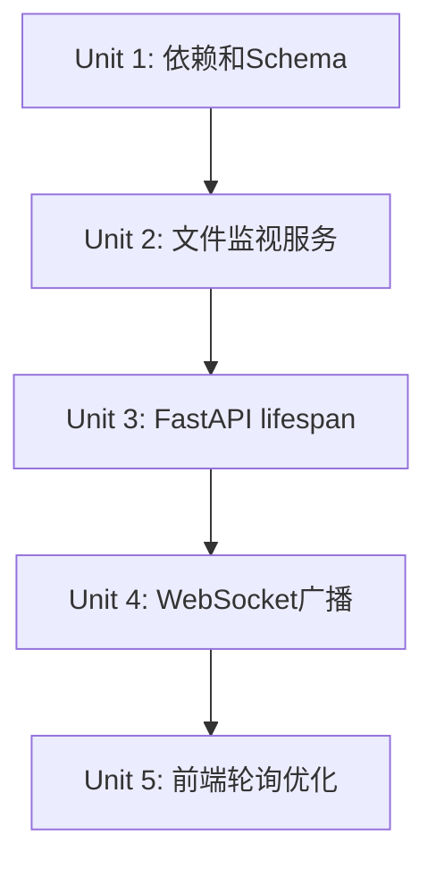

# feat: 实时数据同步

## Overview

实现文件监视器检测 JSONL 文件变化，通过 WebSocket 实时推送统计数据更新到前端 viewer，解决用户需要手动刷新才能看到新数据的问题。

## Problem Frame

**用户痛点**: 点击爬取后，viewer 页面不会实时更新数据。

**根本原因**:
1. 爬虫以子进程运行，独立写入 JSONL 文件
2. FastAPI 主进程不知道文件何时被修改
3. 前端 WebSocket 处理器已准备好接收 `stats_update` 消息，但后端从未发送

**技术方案**: 使用 `watchdog` 库监听文件变化，200ms 防抖后通过现有 WebSocket 广播机制推送更新。

## Requirements Trace

- R1. 使用 `watchdog` 库监听 `data/xhs/jsonl/` 目录
- R2. 检测到文件追加时触发通知
- R3. 收集 200ms 时间窗口内的所有文件变化事件
- R4. 时间窗口结束时，通过 WebSocket 广播 `stats_update` 消息
- R5. 消息格式: `{"type": "stats_update", "total_notes": N, "total_images": M, "timestamp": "..."}`
- R6. 文件监视器作为 FastAPI 后台任务启动
- R7. 应用关闭时优雅停止文件监视器
- R8. WebSocket 连接建立时立即广播当前统计数据
- R9. WebSocket 活跃时禁用轮询（前端已有降级机制）

## Scope Boundaries

**包含**:
- 添加 `watchdog` 依赖
- 创建文件监视后台任务
- 修改 WebSocket 广播逻辑
- 前端消息处理（已存在，无需修改）

**不包含**:
- 修改爬虫核心代码
- 添加 Redis 或其他消息队列
- 增量数据推送（只推送统计变化）
- 多平台数据同步（仅限小红书）

## Context & Research

### Relevant Code and Patterns

| 文件 | 模式 | 用途 |
|------|------|------|
| `api/routers/websocket.py` | `ConnectionManager` + `log_broadcaster()` | WebSocket 广播模式，复用 |
| `api/services/crawler_manager.py` | `asyncio.Queue` + 后台任务 | 异步队列模式，复用 |
| `api/main.py` | FastAPI app 初始化 | lifespan 钩子注入点 |
| `viewer/static/js/monitor.js` | `handleWebSocketMessage()` | 前端已支持 `stats_update` |

### Technology Stack

- Python 3.11+
- FastAPI 0.110.2
- Uvicorn 0.29.0
- Pydantic 2.5.2
- **新增**: watchdog (待添加)

### Watchdog 集成要点

1. Windows 使用 `WindowsApiObserver` (基于 `ReadDirectoryChangesW`)
2. Observer 运行在独立线程，需要通过 `asyncio.run_coroutine_threadsafe()` 与 FastAPI 事件循环通信
3. 使用 `on_modified` 事件检测文件变化
4. 通过追踪文件大小判断是否为追加写入

## Key Technical Decisions

| 决策 | 选择 | 理由 |
|------|------|------|
| 文件监视库 | watchdog | 跨平台支持，Windows API 原生实现 |
| 线程模型 | Observer 线程 + asyncio 桥接 | watchdog 是线程模型，FastAPI 是 asyncio |
| 推送策略 | 批量防抖 200ms | 减少 UI 闪烁，平衡实时性 |
| 计数器 | 广播时重新计算 | 确保数据一致性，避免增量同步复杂度 |
| 消息类型 | `stats_update` | 前端已有处理逻辑 |

## Open Questions

### Resolved During Planning

- **Q: watchdog 在 Windows 上的表现？**
  - A: 使用 `WindowsApiObserver`，基于 `ReadDirectoryChangesW`，性能良好
- **Q: 如何桥接 watchdog 线程和 asyncio？**
  - A: 使用 `asyncio.run_coroutine_threadsafe()` 将事件传递到主事件循环
- **Q: 如何检测追加写入？**
  - A: 追踪文件大小，只有大小增加时才触发通知

### Deferred to Implementation

- **文件锁定**: Windows 文件锁定问题 - 读取统计时使用标准文件 API，不需要特殊处理
- **防抖定时器重置**: 快速连续事件时如何取消并重新调度定时器

## Implementation Units

### Unit Dependency Graph



---

- [ ] **Unit 1: 添加依赖和 Schema 定义**

**Goal:** 添加 watchdog 依赖，定义 stats_update 消息的 Pydantic schema

**Requirements:** R1, R5

**Dependencies:** None

**Files:**
- Modify: `MediaCrawler/pyproject.toml` - 添加 `watchdog` 依赖
- Modify: `MediaCrawler/api/schemas/crawler.py` - 添加 `StatsUpdateMessage` schema

**Approach:**
1. 在 `pyproject.toml` 的 dependencies 中添加 `watchdog>=3.0.0`
2. 创建 `StatsUpdateMessage` Pydantic model，包含 `type`, `total_notes`, `total_images`, `timestamp` 字段
3. 在 `api/schemas/__init__.py` 中导出新 schema

**Patterns to follow:**
- 现有 `LogEntry` schema 的结构风格

**Test scenarios:**
- Happy path: Schema 正确序列化为 JSON
- Edge case: 所有字段都有默认值

**Verification:**
- `uv sync` 成功安装 watchdog
- Schema 可以正确导入

---

- [ ] **Unit 2: 创建文件监视服务**

**Goal:** 实现 `FileWatcherService` 类，监听 JSONL 目录变化并触发回调

**Requirements:** R1, R2, R3

**Dependencies:** Unit 1

**Files:**
- Create: `MediaCrawler/api/services/file_watcher.py`
- Modify: `MediaCrawler/api/services/__init__.py` - 导出新服务

**Approach:**
1. 创建 `FileWatcherService` 类
2. 在 `__init__` 中初始化 `_file_sizes: Dict[str, int]` 和获取事件循环引用
3. 在 `start()` 中：扫描现有文件初始化 `_file_sizes`，启动 watchdog Observer 监听目录
4. 使用 `watchdog.observers.Observer` 监听 `data/xhs/jsonl/` 目录
5. 实现 `FileSystemEventHandler` 子类处理 `on_modified` 事件
6. 只有文件大小增加才触发通知（追加写入检测）
7. 使用 `threading.Timer` 实现防抖：每次事件重置定时器
8. 防抖触发时，通过 `asyncio.run_coroutine_threadsafe()` 调用异步回调
9. 使用 `threading.Lock` 保护 `_pending_events` 的线程安全
10. `stop()` 方法：停止 Observer，调用 `join(timeout=5.0)` 等待线程结束

**Technical design (directional):**
```
FileWatcherService:
  - _observer: Observer
  - _event_loop: asyncio.AbstractEventLoop
  - _debounce_timer: Optional[threading.Timer]
  - _pending_events: Set[str]  # protected by _lock
  - _lock: threading.Lock
  - _file_sizes: Dict[str, int]
  - _callback: Callable

  + __init__()  # capture current event loop
  + start(path: str, callback: Callable)  # sync, starts observer thread
  + stop()  # sync, stops and joins observer
  - _on_file_modified(event)  # runs in observer thread
  - _schedule_debounce()  # reset timer on each event
  - _do_callback()  # called by timer, bridges to async
```

**Patterns to follow:**
- `crawler_manager.py` 的 `asyncio.Queue` 模式
- `websocket.py` 的 `log_broadcaster` 后台任务模式

**Test scenarios:**
- Happy path: 文件修改触发回调
- Edge case: 文件大小减少时忽略
- Edge case: 快速连续修改只触发一次回调（防抖）
- Error path: 监视目录不存在时优雅处理

**Verification:**
- 文件修改后，回调被调用
- 防抖正确工作（200ms 内多次修改只触发一次）

---

- [ ] **Unit 3: FastAPI lifespan 集成**

**Goal:** 在 FastAPI 应用启动时启动文件监视器，关闭时优雅停止

**Requirements:** R6, R7

**Dependencies:** Unit 2

**Files:**
- Modify: `MediaCrawler/api/main.py` - 添加 lifespan 上下文管理器

**Approach:**
1. 在 `api/main.py` 中定义 `lifespan` 异步上下文管理器
2. startup 时创建 `FileWatcherService` 实例
3. 调用 `file_watcher.start()` (同步方法，启动 observer 线程)
4. 将服务实例存储在 `app.state.file_watcher`
5. shutdown 时调用 `file_watcher.stop()` 方法
6. 将 lifespan 传递给 `FastAPI(lifespan=lifespan)`

**Technical design (directional):**
```python
@asynccontextmanager
async def lifespan(app: FastAPI):
    # Startup
    file_watcher = FileWatcherService()
    file_watcher.start(  # sync, not async
        path=str(DATA_DIR / "xhs" / "jsonl"),
        callback=broadcast_stats_update
    )
    app.state.file_watcher = file_watcher
    yield
    # Shutdown
    file_watcher.stop()  # sync, joins observer thread
```

**Patterns to follow:**
- FastAPI 官方 lifespan 模式

**Test scenarios:**
- Happy path: 应用启动后文件监视器运行
- Happy path: 应用关闭时文件监视器停止
- Integration: 文件修改后，WebSocket 收到消息

**Verification:**
- 启动服务器后，修改 JSONL 文件，查看日志确认监视器工作
- 关闭服务器时无异常

---

- [ ] **Unit 4: WebSocket 广播集成**

**Goal:** 文件变化时广播 `stats_update` 消息，新连接时同步当前状态

**Requirements:** R4, R5, R8

**Dependencies:** Unit 3

**Files:**
- Modify: `MediaCrawler/api/routers/websocket.py` - 添加广播函数和连接处理

**Approach:**
1. 创建 `broadcast_stats_update()` 异步函数
2. 调用现有 `notes.py` 的 `get_notes_stats()` 获取统计数据（广播时重新计算，确保一致性）
3. 构造 `StatsUpdateMessage` 并调用 `manager.broadcast()` 发送
4. 修改 `websocket_status` 端点：连接后立即发送当前统计数据
5. 导入 `StatsUpdateMessage` from `api.schemas.crawler`

**Patterns to follow:**
- 现有 `log_broadcaster()` 的广播模式
- `ConnectionManager.broadcast()` 方法

**Test scenarios:**
- Happy path: 文件修改后，所有连接的客户端收到消息
- Integration: 新 WebSocket 连接立即收到当前统计数据
- Edge case: 无连接时广播不报错

**Verification:**
- 打开 viewer 页面，修改 JSONL 文件，看到数据自动更新
- 刷新页面后立即看到正确统计数据

---

- [ ] **Unit 5: 前端轮询优化**

**Goal:** WebSocket 活跃时禁用轮询，减少不必要的 API 调用

**Requirements:** R9

**Dependencies:** Unit 4

**Files:**
- Modify: `MediaCrawler/viewer/static/js/monitor.js`

**Approach:**
1. 在 WebSocket `onopen` 时调用 `stopPolling()`
2. 在 WebSocket `onclose` 时调用 `startPolling()`
3. 确保断线时自动降级到轮询模式

**Patterns to follow:**
- 现有 `startPolling()` 和 `stopPolling()` 函数

**Test scenarios:**
- Happy path: WebSocket 连接后轮询停止
- Edge case: WebSocket 断开后轮询恢复
- Integration: 整体实时更新流程工作

**Verification:**
- 打开浏览器开发者工具，WebSocket 连接后不再看到轮询请求

---

## System-Wide Impact

### Interaction Graph

```
文件系统
    ↓ (watchdog)
FileWatcherService
    ↓ (callback)
broadcast_stats_update()
    ↓ (WebSocket)
ConnectionManager
    ↓ (broadcast)
所有连接的前端客户端
```

### Error Propagation

- 文件监视失败 → 记录日志，不影响现有功能
- WebSocket 广播失败 → 单个连接断开，不影响其他连接
- 防抖超时 → 正常恢复

### State Lifecycle

- 文件监视器独立于 WebSocket 连接运行
- 启动时扫描现有文件初始化 `_file_sizes` 字典
- 不需要持久化状态，每次广播时重新计算统计确保一致性

### Integration Coverage

- 文件写入 → 监视器检测 → 广播 → 前端刷新 → API 读取文件
- 需要测试整个链路的端到端行为

## Risks & Dependencies

| Risk | Mitigation |
|------|------------|
| watchdog 线程与 asyncio 事件循环冲突 | 使用 `asyncio.run_coroutine_threadsafe()` 正确桥接 |
| Windows 文件锁定问题 | 读取统计时使用标准文件 API |
| 文件正在写入时的部分行 | 广播前重新计算统计，确保一致性 |
| 多 worker 部署不兼容 | 文档明确说明单 worker 限制 |

## Documentation / Operational Notes

- 部署时确保 `uvicorn` 以单 worker 运行（默认行为）
- 如需多 worker，需要引入 Redis pub/sub（超出当前范围）

## Sources & References

- **Origin document:** [docs/brainstorms/2026-04-20-realtime-data-sync-requirements.md](../brainstorms/2026-04-20-realtime-data-sync-requirements.md)
- **Watchdog docs:** https://github.com/gorakhargosh/watchdog
- **FastAPI lifespan:** https://fastapi.tiangolo.com/advanced/events/
